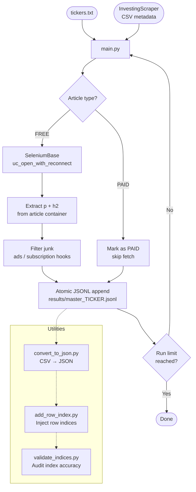

# FetchNews

> Crash-proof, resumable financial news scraper for Investing.com — built on SeleniumBase with anti-bot evasion.

[](https://www.python.org/)
[](https://seleniumbase.io/)
[]()
[]()
[]()

---

## Overview

**FetchNews** scrapes full article content for a list of stock tickers from [Investing.com](https://www.investing.com). It consumes article metadata (title, link, type) produced by the companion [InvestingScraper](https://github.com/llm-trading/InvestingScraper) repo, then fetches the body text of every free article using a stealth browser.

Key properties:
- **Resumable** — tracks already-fetched links; safe to kill and restart at any point
- **Crash-proof** — atomic JSONL append after every article; no data loss on browser crash
- **Anti-bot evasion** — undetected-chromedriver, rotating user agents, randomized delays, ad blocking
- **Continuity guard** — aborts on row-index divergence to prevent mismatched data

---

## Pipeline Architecture



---

## Project Structure

```
FetchNews/
├── main.py                  # Core scraper — orchestrates all tickers
├── fetchArticleTest.py      # Single-URL extraction test (non-headless)
├── convert_to_json.py       # Convert JSONL/CSV outputs to JSON
├── add_row_index.py         # Back-fill row indices from source CSVs
├── validate_indices.py      # Validate row index alignment vs source CSVs
├── tickers.txt              # One ticker slug per line
└── results/
    └── master_<ticker>_articles.jsonl
```

---

## Quickstart

### 1. Install dependencies

```bash
pip install seleniumbase pandas
```

SeleniumBase manages its own browser drivers — no manual ChromeDriver setup needed.

### 2. Configure tickers

Edit `tickers.txt` — one Investing.com ticker slug per line:

```
nvidia-corp
amazon-com-inc
palantir-technologies-inc
```

### 3. Run the scraper

```bash
python main.py
```

On first run it auto-clones [InvestingScraper](https://github.com/llm-trading/InvestingScraper) to get the source CSVs. Results land in `results/master_<ticker>_articles.jsonl`.

To resume after interruption — just run again. Already-fetched links are skipped automatically.

---

## Configuration

All tunables live at the top of [main.py](main.py):

| Variable | Default | Description |
|---|---|---|
| `RUN_LIMIT` | `300` | Max articles to fetch per run |
| `BROWSER_CYCLE` | `50` | Articles before browser restart |
| `COOLDOWN_BATCH` | `10` | Articles between cooldown pauses |
| `SOURCE_REPO_URL` | GitHub URL | InvestingScraper repo to clone |
| `RESULTS_DIR` | `results` | Output directory |

---

## Output Format

Each line in the JSONL output is one article:

```json
{
  "title": "NVIDIA Taps Samsung, SK Hynix as HBM4 Suppliers",
  "link": "https://www.investing.com/news/...",
  "source": "Reuters",
  "time": "2024-03-15 14:32:00",
  "type": "free",
  "row_index": 42,
  "content": "NVIDIA Corp said on Friday it has selected...\n\nThe decision marks..."
}
```

`content` values for non-standard cases:

| Value | Meaning |
|---|---|
| `PAID` | Article behind paywall — skipped |
| `SELECTOR_NOT_FOUND` | Page structure changed or IP blocked |
| `EMPTY_CONTENT` | Page loaded but extracted no usable text |
| `ERROR_FETCHING: ...` | Network / timeout error |

---

## Utility Scripts

### `fetchArticleTest.py`
Single-article extraction test. Opens browser in non-headless mode so you can watch the scrape live. Useful for debugging selector changes.

```bash
python fetchArticleTest.py
```

### `convert_to_json.py`
Converts result files (CSV or JSONL) to pretty-printed JSON. Handles malformed content fields and multiple encodings with automatic fallback.

```bash
python convert_to_json.py                    # Default: results/ directory
python convert_to_json.py <input_dir> <output_dir>
```

### `add_row_index.py`
Back-fills `row_index` fields in JSONL outputs by cross-referencing the original source CSVs. Use when you have older outputs that predate row tracking.

```bash
python add_row_index.py
```

### `validate_indices.py`
Audits JSONL row indices against source CSVs and reports mismatches. Prints per-ticker accuracy.

```bash
python validate_indices.py
```

---

## Anti-Detection Strategy

| Technique | Implementation |
|---|---|
| Undetected Chromedriver | `SB(uc=True)` |
| Randomized user agent | 4 real Chrome UA strings rotated per browser session |
| Incognito mode | `incognito=True` — no persistent cookies |
| Ad blocking | `ad_block=True` — faster loads, fewer fingerprint surfaces |
| Human scroll jitter | `window.scrollBy(0, 400)` before element access |
| Random inter-article delay | `sleep(3–6s)` between articles |
| Batch cooldown | `sleep(15–25s)` every 10 articles |
| Browser recycling | Fresh browser process every 50 articles |
| Random window size | `1024–1920 × 768–1080` per session |

---

## Covered Tickers

| Ticker | Company |
|---|---|
| `micron-tech` | Micron Technology |
| `eliem-therapeutics` | Eliem Therapeutics |
| `nvidia-corp` | NVIDIA Corporation |
| `northrop-grumman` | Northrop Grumman |
| `palantir-technologies-inc` | Palantir Technologies |
| `adv-micro-device` | Advanced Micro Devices |
| `amazon-com-inc` | Amazon.com Inc |

---

## Requirements

- Python 3.9+
- `seleniumbase`
- `pandas`
- Chrome / Chromium (auto-managed by SeleniumBase)
- Linux recommended for production runs (`xvfb=True` headless support)

---

## Related

- [InvestingScraper](https://github.com/llm-trading/InvestingScraper) — upstream repo that produces the article metadata CSVs consumed by this project
